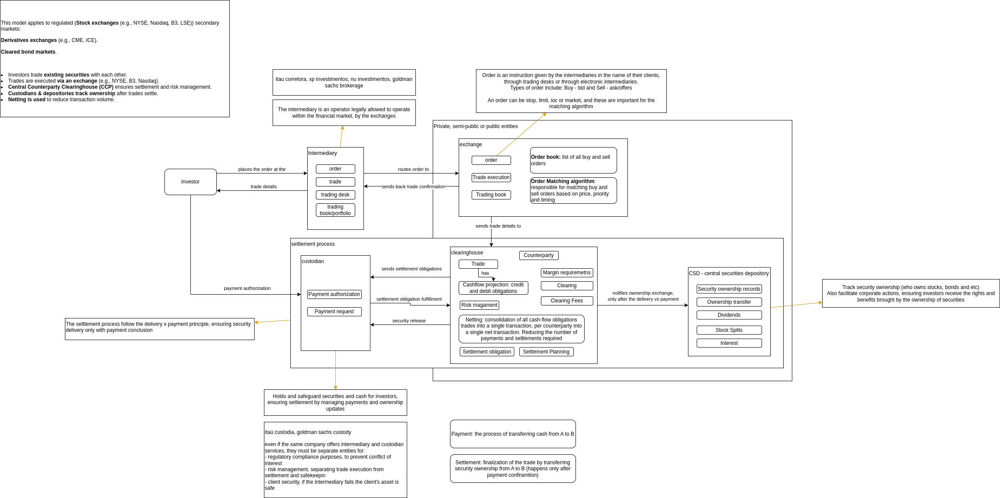
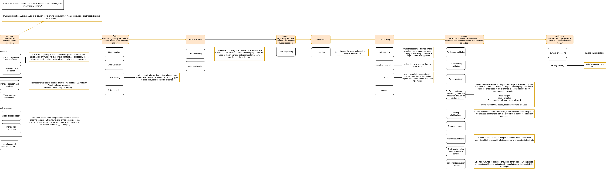
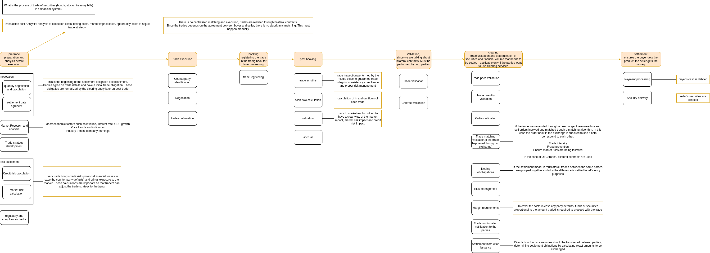

# financial-market

# Regulated market, when trades happen through an exchange

## domain model of the regulated financial market for trades in the secondary market

## Trade workflow in the secondary market

# OTC market, when trades happen directly between the parties

## domain model

## trade workflow

